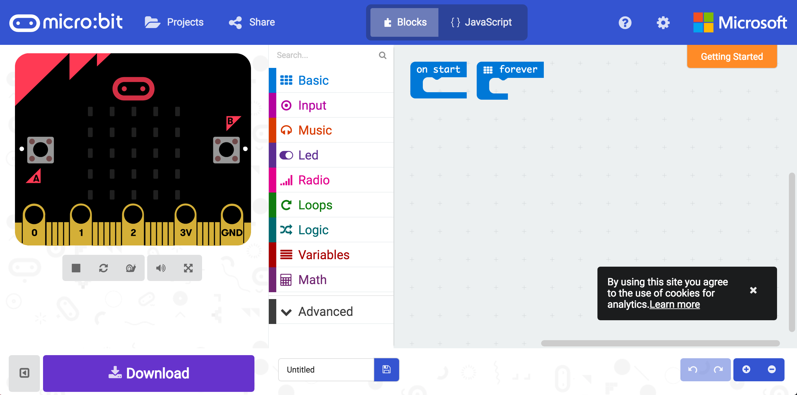
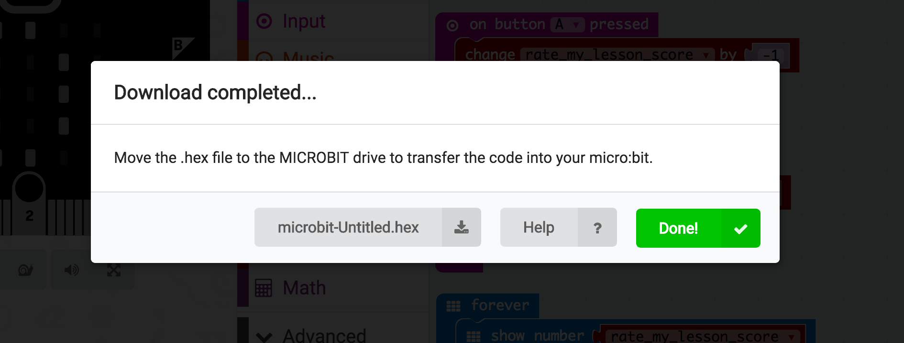

# Guide for teachers

## Intro

By the end of this, your students will have built a system that allows them
to rate lessons by using physical buttons on a BBC Microbit.

It should take a few hours to run this lesson.

## You will need

* A [BBC Microbit](http://microbit.org/) per group. We recommend each group to have 2-4
students.
* Access to a computer with a web browser for each group.

## Step 1 - Get to the simulator

Direct your students to the online simulator at https://makecode.microbit.org.

The interface they're presented with will look something like this:

The right hand side of the interface has the visual editor, where students can drag and drop elements of the program and built it up.

The left side is a virtual version of the Microbit. It functions exactly as a real one would, including pressable buttons.

## Step 2 - Code the program

Students can now use the editor to create the program and test it on the simulator. They can choose to use either the _Blocks_ or _JavaScript_ editor (see the toggle at the top of the screen).

The program needs to do the following things:

1. Keep record of a score and display it on the LED panel, beginning at zero.
1. When button A is pressed, decrease the score by one and briefly show an `X` icon on the LED panel.
1. When button B is pressed, increase the score by one and briefly show a `tick` icon on the LED panel.

Testing is an important part of software development, so encourage your students to test that things are working as they go.

To make things easier, we've prepared three different versions of the program in various states of completeness. Choose the one to give your students based on their ability level:

* [Easy](https://makecode.microbit.org/_Hmz9LcecKHUu) - The program is mostly done, they just need to add the logic for incrementing and decrementing the score, along with displaying ticks and crosses.
* [Intermediate](https://makecode.microbit.org/_EyHAwJftdCkg) - Some parts of the program are already filled out, but they'll need to add the scoring logic and the variable to store it.
* [Advanced](https://makecode.microbit.org) - Start from scratch.

[An example of how the finished program may look](https://makecode.microbit.org/_Tq9YXJPPjEuz). Note that the code doesn't have to look exactly like the example, as long as it works anything goes!

## Step 3 - Put the code on the Microbit.

Press the **Download** button in the simulator and a dialog will appear:

To install it to the Microbit, connect it to the computer with USB and copy the downloaded `.hex` file to the MICROBIT drive that appears. [More information](https://makecode.microbit.org/device/usb).

The program will run automatically once it's copied over to the device.

## Next steps

To take this further, some things students could do are:

* Take a look at how the JavaScript code changes when things are changed in the visual editor.
* Implement the ability to reset the score (Hint: there is a built-in action for shaking the Microbit).
* Currently the score is lost whenever the Microbit is turned off. How might they save the score? (Hint: they could save it to a file whenever it changes, and then retrieve the last score from the file when the program starts)
